# AA GEAR — ERP + AI

A small, working ERP for a fictional Israeli electronics retailer, **AA GEAR Electronics**.
Ten n8n workflows, two AI agents, retrieval-augmented answers over the shop's policies and
catalogue, PDF invoice/receipt generation, and a **custom admin dashboard** written from
scratch in a single HTML file with a full right-to-left Hebrew interface.

Everything runs on managed services — **n8n Cloud + Airtable** (+ Qdrant, MongoDB Atlas,
Telegram, Gmail, Google Drive). There is no server to deploy and nothing to run locally.

> Built as the final project for the AI-ERP course. The workflow set (WF-1 … WF-9) follows
> the course template; **WF-13 and the custom dashboard + landing page are original work** —
> see [What is original](#what-is-original-and-what-is-inherited).

---

## Screenshots

### The custom dashboard (WF-13)

Not Airtable's own interface — a purpose-built RTL Hebrew admin panel.

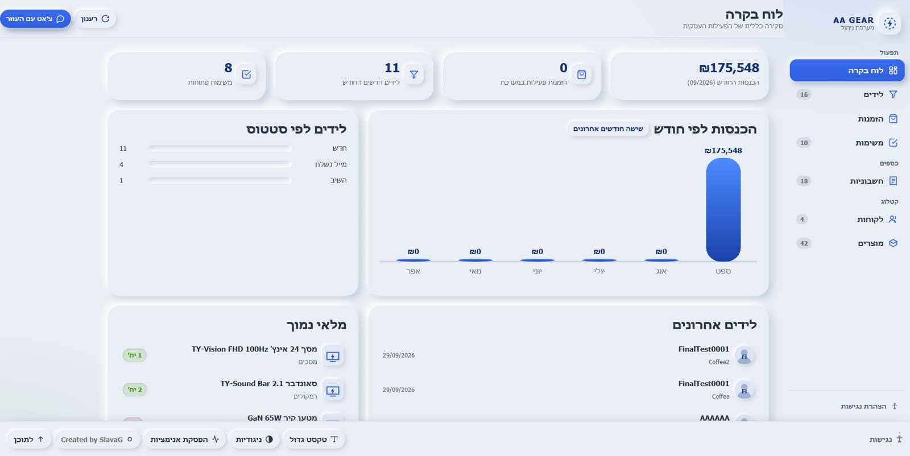

<details>
<summary>More dashboard screens (click to expand)</summary>

| Products | Edit a product |
|---|---|
| 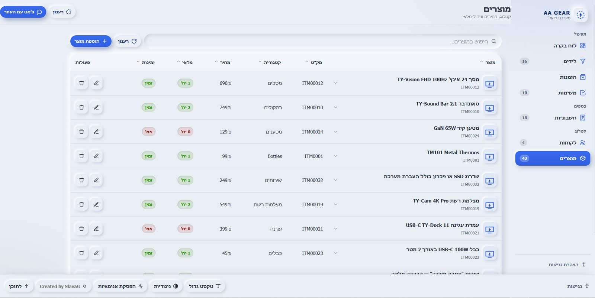 | 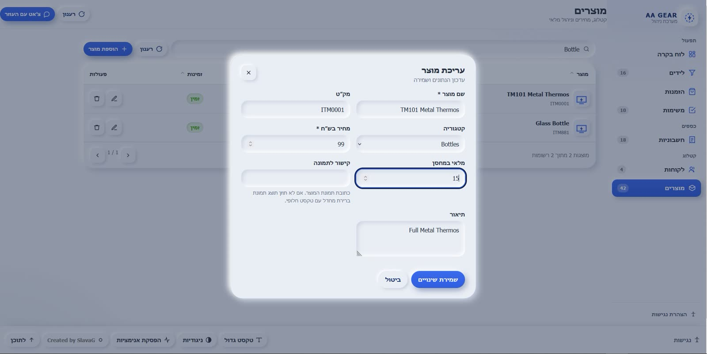 |

| Customers | Lead capture form |
|---|---|
| 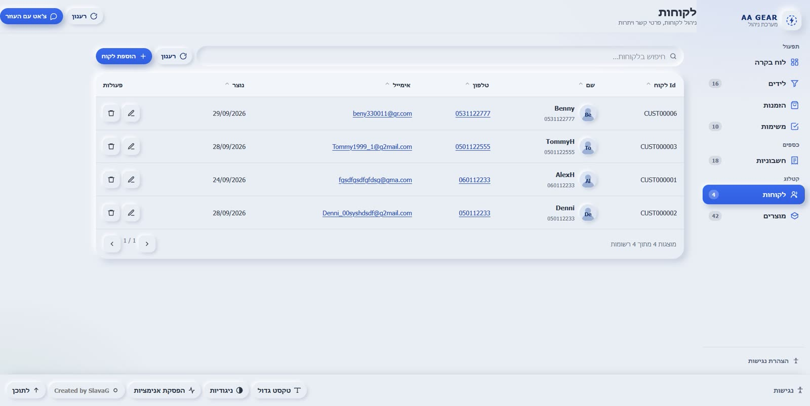 | 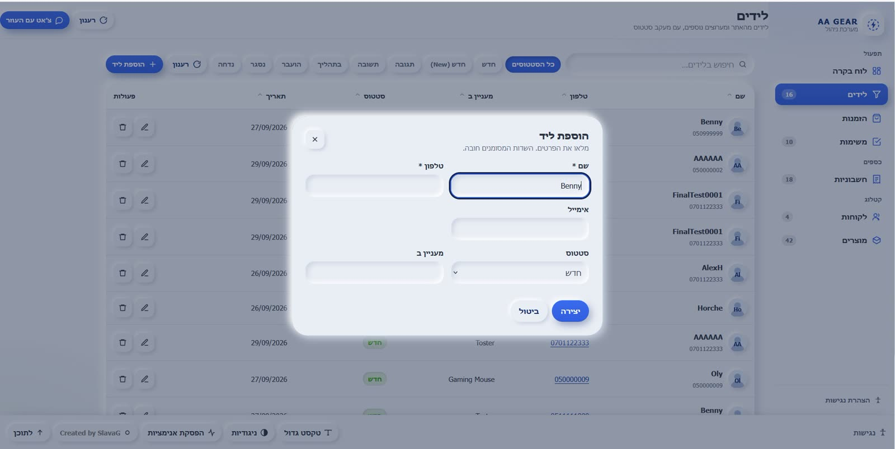 |

| Tasks | Invoice with PDF link |
|---|---|
| 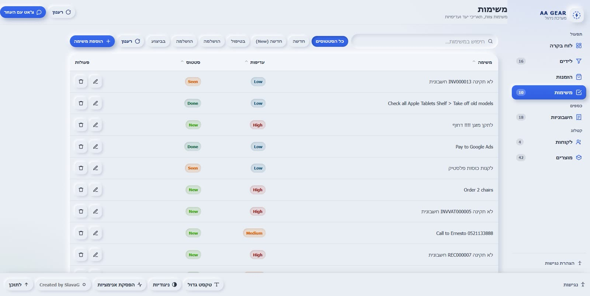 | 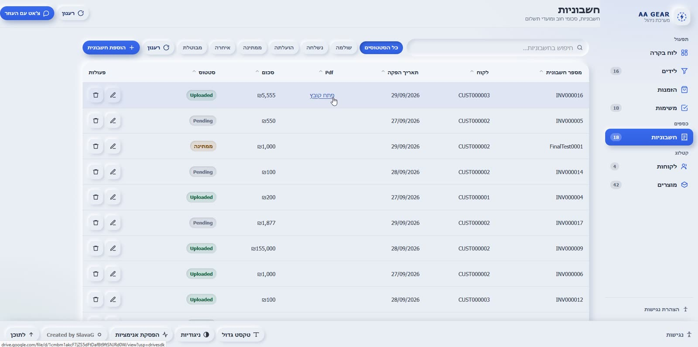 |

</details>

### AI agents

**Customer-service agent (WF-5)** — answers grounded in the policy documents and the product
catalogue, so it cannot invent a return window that the shop has not published.

| Products question | Warranty question |
|---|---|
| 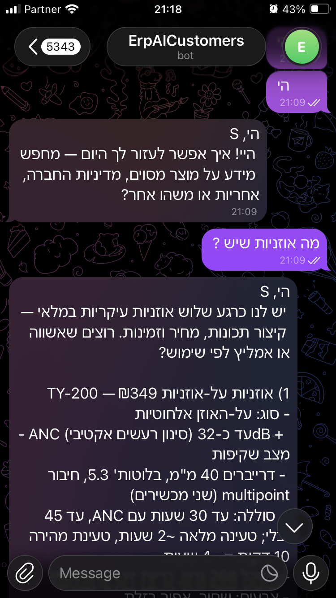 | 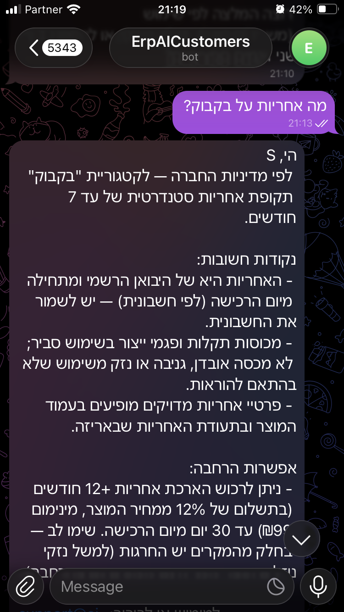 |

**Director agent (WF-9)** — restricted to one Telegram account; anyone else gets a refusal.

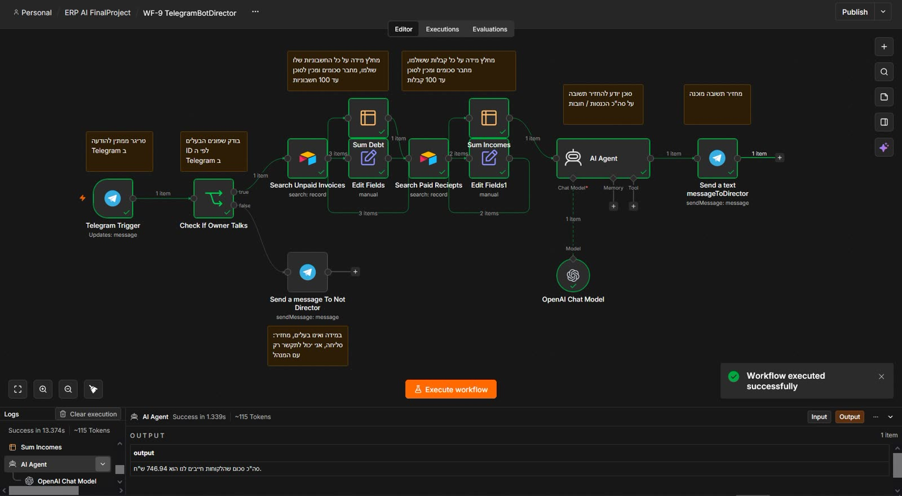

### Invoicing and PDF output (WF-1 → WF-8)

A valid invoice is validated, queued, rendered to PDF and linked back to the record.
An invalid one automatically raises a task for the team instead.

| Valid → PDF | Invalid → task raised |
|---|---|
| 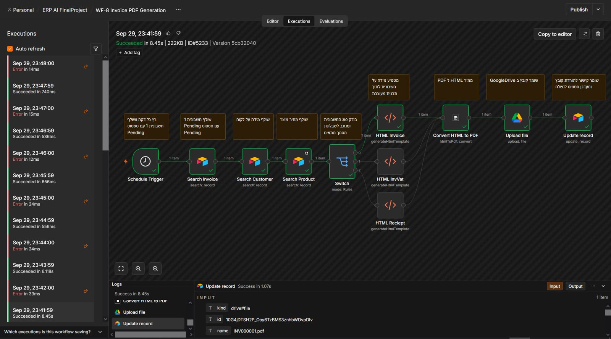 | 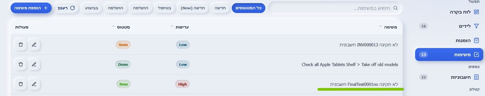 |

All 59 screenshots live in [`docs/screenshots/`](docs/screenshots/), organised one folder per
workflow.

---

## Architecture

```
                       ┌──────────────────────────────────────┐
  visitor  ──────────▶ │  aa-gear-landing.html                │
  (Hebrew, RTL)        │  lead form, Hebrew copy              │
                       └───────────────┬──────────────────────┘
                                       │ POST /ErpAILids   (WF-3)
                                       ▼
  ┌────────────────────────────────────────────────────────────────────┐
  │                        n8n Cloud                                   │
  │                                                                    │
  │  WF-1  invoice validation ──valid──▶ (queue)                       │
  │            │                                                         │
  │            └──invalid──▶ create a Task for the team                 │
  │                                                                    │
  │  WF-4a cold e-mail (every 3h) ──▶ Gmail                             │
  │  WF-4b reply watch (every 30m) ──▶ update Lead status              │
  │                                                                    │
  │  WF-5  customer agent  ◀── Telegram bot #2                         │
  │  WF-9  director agent  ◀── Telegram bot #1  (owner check)          │
  │            │                                                        │
  │            └── Qdrant vector store  ◀── WF-6 / WF-7 embeddings     │
  │                                    (policies + products)            │
  │  WF-13 dashboard API  ◀── the custom dashboard  (read/create/      │
  │            │                       update/delete/chat)             │
  │  WF-8  PDF generator (every 59s) ──▶ Google Drive                  │
  └───────────────┬──────────────────────────────┬─────────────────────┘
                  │                              │
                  ▼                              ▼
        Airtable  (the database)          MongoDB Atlas
        6 tables the app uses             (agent chat memory)
```

**The data flow in one sentence:** the landing page and the dashboard are thin HTTP clients;
all business logic and every write goes through n8n, which owns the Airtable credentials.

---

## The ten workflows

| # | File | Trigger | What it does | Active* |
|---|------|---------|--------------|---------|
| 1 | `WF-1 Invoice Validation.json` | new row in **invoices** (polls every minute) | Checks amount > 0, issue date, customer id, invoice number. Valid → set `Pending` for the PDF stage. Invalid → **create a Task** for the team. | no |
| 3 | `WF-3 Leads Input WebHook.json` | `POST /ErpAILids` | Lead from the website. Looks the email up first, so a repeat submission is answered *"already exists"* instead of creating a duplicate. | no |
| 4a | `WF-4a Cold mail RTL.json` | every 3 hours | Finds un-contacted leads, writes a Hebrew cold e-mail with the chat model, sends via Gmail, marks the lead. | no |
| 4b | `WF-4b EmailReply.json` | Gmail, every 30 min | Watches the mailbox and updates the lead record when a prospect replies. | no |
| 5 | `WF-5 Telegram Bot Customer QDrant.json` | Telegram message | Customer-service agent with **two** Qdrant tools — policy search and product knowledge — plus MongoDB conversation memory. | no |
| 6 | `WF-6 Qdrant Policies.json` | n8n form submission | Chunks the policy documents, embeds them, writes them to the policies collection. | no |
| 7 | `WF-7 QdrantProducts.json` | n8n form submission | Same shape, but for the product catalogue (short records, so no chunking needed). | no |
| 8 | `WF-8 Invoice PDF Generation.json` | every 59 seconds | Picks up `Pending` documents, switches on `InvoiceType`, renders the matching Hebrew HTML template to PDF, uploads to Drive, writes the link back to Airtable. | no |
| 9 | `WF-9 TelegramBotDirector.json` | Telegram message | Director agent. Compares the chat id against the owner's; **non-owners are refused**. Then sums income and outstanding debt. | no |
| 13 | `WF-13 Dashboard.json` | `POST /ERPMainSite` | **The API behind the custom dashboard.** One webhook, a switch on `action` → `read` / `create` / `update` / `delete` / `chat`, with a RAG-backed chat branch. | **yes** |

\* `active` is the value stored inside the exported JSON in `workflows/`. See
[docs/09-known-issues.md](docs/09-known-issues.md#1-only-wf-13-is-active) — this needs fixing
before a demo.

There is no WF-2 or WF-10/11/12 in this project; the numbering follows the course template.

---

## What is original and what is inherited

Being explicit about this, because it matters for grading:

**Inherited from the course template** — the overall architecture and the intent of each
workflow: WF-1, WF-3, WF-4a, WF-4b, WF-5, WF-6, WF-7, WF-8, WF-9. The Airtable-as-database,
n8n-as-backend, Qdrant-for-RAG and Telegram-for-agents shape is the prescribed design.

**Original work in this project**

- **WF-13 — the dashboard API.** The template ships no admin UI; it uses Airtable's own
  interface. WF-13 adds a single webhook that the dashboard calls for every read and write,
  with the table chosen dynamically from the request, plus a grounded chat branch.
- **The admin dashboard itself** (`app/aa-gear-admin.html`) — one self-contained HTML file:
  RTL layout, Hebrew throughout, keyboard-operable product descriptions, live search, sorting,
  pagination, filter chips, inline validation, dialogs, toasts, a skeleton loader and a
  preloader. No framework, no build step, no dependencies.
- **The landing page** (`app/aa-gear-landing Final.html`) — RTL marketing page whose lead form
  is what feeds WF-3.
- The data-model decisions below (one `invoices` table with an `InvoiceType` field rather than
  three near-identical tables) and the bilingual/Hebrew-first UX decisions.

---

## Stack

| Layer | Choice | Why |
|---|---|---|
| Database | **Airtable** | Free, instant, already has a UI for spot-checking data. |
| Automation | **n8n Cloud** | Managed, so no server; gives public HTTPS URLs for webhooks. |
| Vector store | **Qdrant** | Free tier, real metadata filtering. |
| Chat memory | **MongoDB Atlas** | Survives agent restarts, unlike in-memory memory. |
| Agents | n8n LangChain nodes | Chat + embeddings, both behind swappable OpenAI-compatible credentials. |
| Frontend | Plain HTML/CSS/JS | Two static files, no build step, deployable anywhere. |
| Tax | Israeli rules | 18% VAT, and the three-way tax-invoice / invoice / receipt distinction. |

---

## Getting started

The full ordered runbook is in **[docs/08-setup-runbook.md](docs/08-setup-runbook.md)**. In
short you need accounts for: n8n Cloud, Airtable, Qdrant, MongoDB Atlas, two Telegram bots,
Gmail + Google Drive OAuth, and an OpenAI-compatible chat **and** embeddings endpoint.

Then:

1. Create the Airtable tables from [`schema/schema.json`](schema/schema.json) — it is derived
   from the dashboard code, so it is exactly what the app reads and writes.
2. Import the ten JSON files from `workflows/` into n8n.
3. Create one n8n credential per service and attach it to the nodes.
4. Activate the workflows.
5. Run WF-6 and WF-7 to fill the vector stores.
6. Open `app/aa-gear-admin.html` and point it at your WF-13 webhook.

---

## Repository layout

```
app/            the two HTML files (dashboard + landing page), no build step
workflows/      the ten n8n workflow exports, original filenames kept
schema/         schema.json — derived from the dashboard code, the contract for the base
docs/           written guides, one file per topic
docs/screenshots/  59 screenshots, one folder per workflow
SECURITY.md     what this repo contains that must not be published publicly
```

---

## Known limitations and open issues

Full detail, with the evidence, in
**[docs/09-known-issues.md](docs/09-known-issues.md)**. The short list:

1. **Only WF-13 is active** in the exported workflows — the other nine are switched off.
2. **The landing page posts to `…/webhook-test/…`**, which only resolves while the n8n editor
   is open. It must point at `…/webhook/…` or lead capture silently fails.
3. **Every field on the `orders` screen is unmapped**, so saving an order writes an empty
   record; `products.imageUrl` is collected and then discarded.
4. **The invoice form asks for a customer *name* and writes it into the `CustomerId` *code*
   field** — an existing record will not be matched.
5. **WF-8 needs the community node** `@custom-js/n8n-nodes-pdf-toolkit-v2`, which cannot be
   installed on n8n Cloud's free plan.
6. Airtable's `InStock` field is typed as text, which makes product saves fail with HTTP 500.
7. Relations are plain text keys (`CUST000003`), not Airtable links, and invoice numbering can
   race if two documents land in the same 59-second poll window.

Documenting these is deliberate: a project that hides its own bugs is harder to trust than one
that names them.

---

## Security

**This repository is private and must stay private.** It contains a live, unauthenticated
n8n webhook that can write to the Airtable base, the Airtable base id, and the director bot's
Telegram chat id. Read [SECURITY.md](SECURITY.md) before changing its visibility.

---

## Credits

- The course template project, from which the workflow architecture and the WF numbering
  derive: <https://github.com/tomerfooks/jb-erp-ai>
- n8n, Airtable, Qdrant, MongoDB Atlas, Telegram — the platforms this runs on.
