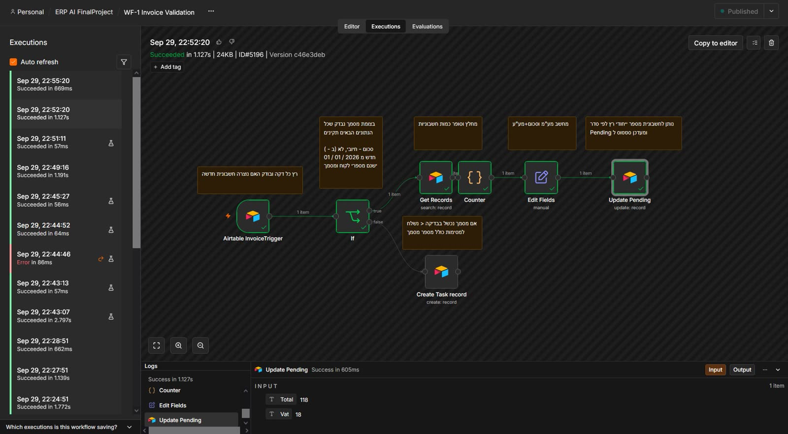
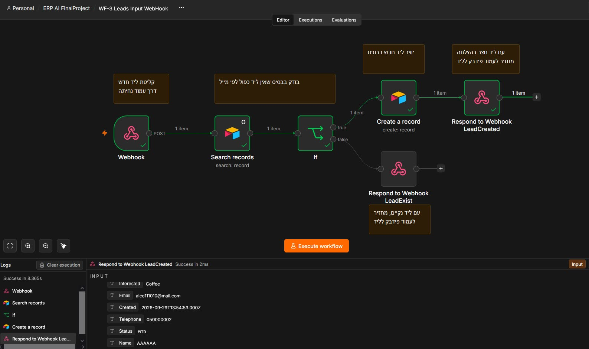
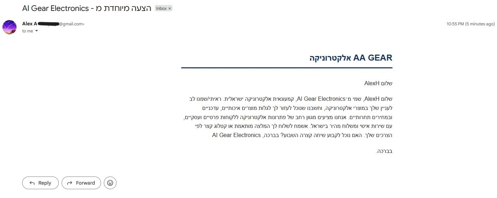
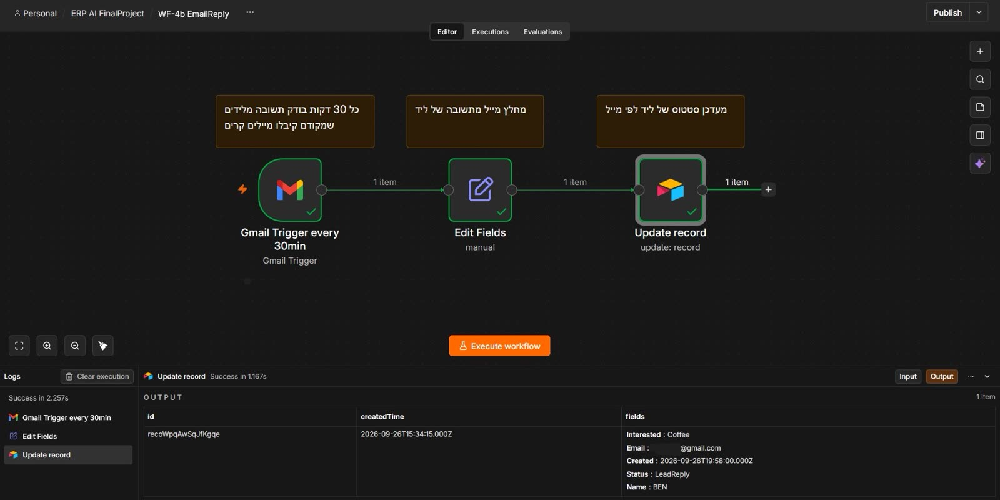
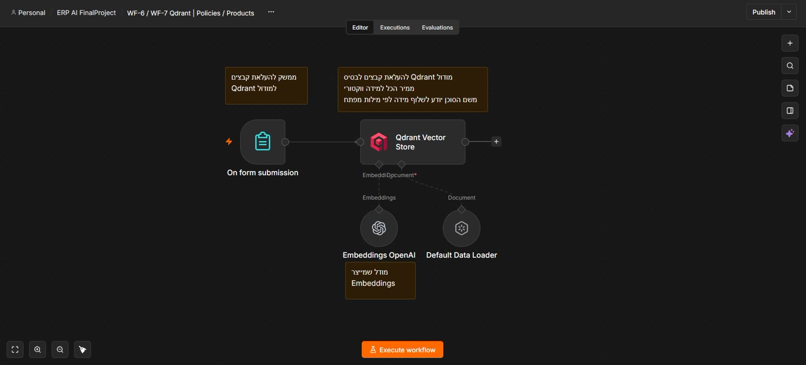
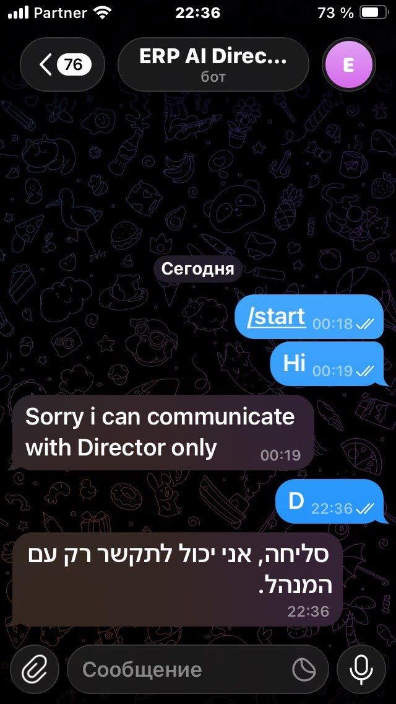

# 03 — The ten workflows

One section per workflow: what triggers it, what it actually does, and what to watch out for.
Filenames in `workflows/` are the originals, kept so the exports can be matched back to the
originals. The `active` column reflects the value stored in the exported JSON — see
[09-known-issues.md](09-known-issues.md#1-only-wf-13-is-active).

---

## WF-1 — Invoice validation

`WF-1 Invoice Validation.json` · trigger: new row in `invoices`, polled every minute

A business rule, expressed as an if/else.

**Valid** — amount above zero, an issue date, a customer id and an invoice number — sets
`Status = Pending`, which is the queue WF-8 reads from.

**Invalid** — creates a row in `tasks` describing which condition failed, assigned to the team.
The choice to *raise a task* rather than reject is what makes the workflow useful: a bad invoice
is a piece of work, and a person has to look at it.

Points worth knowing:

- It polls, because Airtable has no webhook trigger on the free plan. A new invoice is therefore
  validated up to ~60s after creation.
- Validation is duplicated rather than centralised; the same four conditions are implicit in
  the PDF templates. A fix in one place will not fix the other.
- Status is written back to the same row, so the workflow re-triggers on its own write. Airtable
  tolerates this, but it means a misconfigured filter can loop.

---

## WF-3 — Lead intake webhook

`WF-3 Leads Input WebHook.json` · trigger: `POST /webhook/ErpAILids`

The landing page's only integration point. Dedupe, create, answer in plain text.

The dedupe is a `search` on the email before the `create`. If the email is already in Airtable,
it replies *"already exists"* and stops.

**The response contract is brittle.** It returns the raw strings `LidCreated` and `LidExist` —
missing vowels, an artifact of a long-ago rename. The landing page's parser tolerates it by
checking for a substring rather than comparing exactly, so it works, but any consumer that
compares equality will break. Both sides are documented here because the fix is a two-minute
change in each file and nobody has made it.

⚠️ **The landing page currently posts to `/webhook-test/ErpAILids`, not `/webhook/`.** A test
webhook only resolves while the n8n editor is open. See
[09-known-issues.md](09-known-issues.md#2-the-landing-page-posts-to-a-test-webhook).

---

## WF-4a — Cold e-mail

`WF-4a Cold mail RTL.json` · trigger: every 3 hours

Finds leads that have not been contacted, asks the chat model to write a Hebrew e-mail for that
lead, sends it through Gmail, and marks the lead so the next run skips it.

The Hebrew-first instruction matters here: a cold e-mail in English to an Israeli prospect
reads as spam. The prompt asks for a short, friendly, RTL-safe message with the shop's tone.

A **node limit** applies on n8n Cloud's free plan, and this workflow is close to it. If a run
fails with a limit error, split the search and the send.

---

## WF-4b — Reply watch

`WF-4b EmailReply.json` · trigger: Gmail, every 30 minutes

Polls the mailbox for replies to the cold e-mails and updates the matching lead's `Status`, so
the sales funnel reflects reality instead of guesswork.

The join between a Gmail thread and an Airtable lead is by email address. It works, and it
breaks the moment a prospect replies from a different address.

---

## WF-5 — Customer service agent

`WF-5 Telegram Bot Customer QDrant.json` · trigger: Telegram message

The customer-facing agent. The interesting part is that it is given **two** retrieval tools
against **two** collections:

- `qdrant_policy` — the shop's published policies: warranty, returns, shipping
- `qdrant_products` — the catalogue: what exists, at what price, whether it is in stock

One agent with two tools, rather than two agents, because the questions genuinely cross over
("can I return the headphones I bought last week, and do you have them in blue?"). Splitting
them would mean guessing which one the user meant.

Conversation memory lives in MongoDB Atlas, so the agent remembers within a session but
survives a restart.

The grounding rule: the agent is instructed to answer only from the two collections and to
decline when they do not cover the question. That is what stops it inventing a return window.
See [06-ai-agents.md](06-ai-agents.md).

| Product question | Policy question |
|---|---|
|  |  |

---

## WF-6 — Policy embeddings

`WF-6 Qdrant Policies.json` · trigger: n8n form submission

Takes a policy document, splits it into chunks, embeds each chunk, and writes it to the
`policies` Qdrant collection with the source name as metadata.

This is the ingestion half of [05-rag-pipeline.md](05-rag-pipeline.md). It is a **form
trigger**, not a webhook, so re-ingestion is a manual web-form submit — which is fine for a
policy document that changes twice a year, and would not be for a product feed.

---

## WF-7 — Product embeddings

`WF-7 QdrantProducts.json` · trigger: n8n form submission

The same shape, but for products, and **without chunking**: a product record is short enough
that chunking it would produce exactly one chunk and lose the ability to filter cleanly. Each
product becomes one vector, keyed by its SKU.

The lesson is that the chunking decision is per-corpus, not per-pipeline.

---

## WF-8 — PDF generation

`WF-8 Invoice PDF Generation.json` · trigger: every 59 seconds

The rendering stage. Picks up `Pending` documents, switches on `InvoiceType`, renders the
matching Hebrew template, converts it to PDF, uploads it to Google Drive, and writes the link
back to the invoice row.

Three templates, chosen by `InvoiceType`: `חשבונית` (invoice), `חשבונית מס` (tax invoice),
`קבלה` (receipt). They differ in required legal fields, not just wording — see
[07-document-pdf.md](07-document-pdf.md).

Two constraints:

- it depends on the community node `@custom-js/n8n-nodes-pdf-toolkit-v2`, which is **not
  installable on n8n Cloud's free plan**;
- a 59-second poll means an invoice can sit in `Pending` for up to a minute, and two invoices
  created in the same window can race on their number.

---

## WF-9 — Director agent

`WF-9 TelegramBotDirector.json` · trigger: Telegram message

A second agent, deliberately more restricted:

1. **Owner check first.** The incoming chat id is compared against a stored value. Anything that
   does not match gets a refusal and the workflow ends. This is the entire authorisation model.
2. Only then does it answer, and it answers with arithmetic over Airtable: total income, and
   what is still owed.

The owner check is a *bot-identity* check, not an authentication system. Anyone who can spoof a
Telegram chat id can talk to it. For a course project that is the accepted trade; for anything
real it is not. It is called out in [09-known-issues.md](09-known-issues.md).

| Refusal | Report |
|---|---|
|  |  |

---

## WF-13 — Dashboard API

`WF-13 Dashboard.json` · trigger: `POST /webhook/ERPMainSite` · **the original contribution**

The API behind the custom dashboard, and the reason the dashboard exists. A switch on `action`:

| `action` | Behaviour |
|---|---|
| `read` | list or get records from the table named in the request |
| `create` | insert a record |
| `update` | patch a record by its Airtable id |
| `delete` | remove a record |
| `chat` | grounded question over policies + products, no write |

The table is taken from the request body, so a single webhook serves all six tables and the
dashboard needs one `api()` helper rather than six. `chat` is the only branch that touches the
vector store instead of Airtable.

**Security note.** This webhook is unauthenticated: anyone with the URL can write to the base.
That is the most important line in [SECURITY.md](../SECURITY.md) and the reason the repository
is private.

