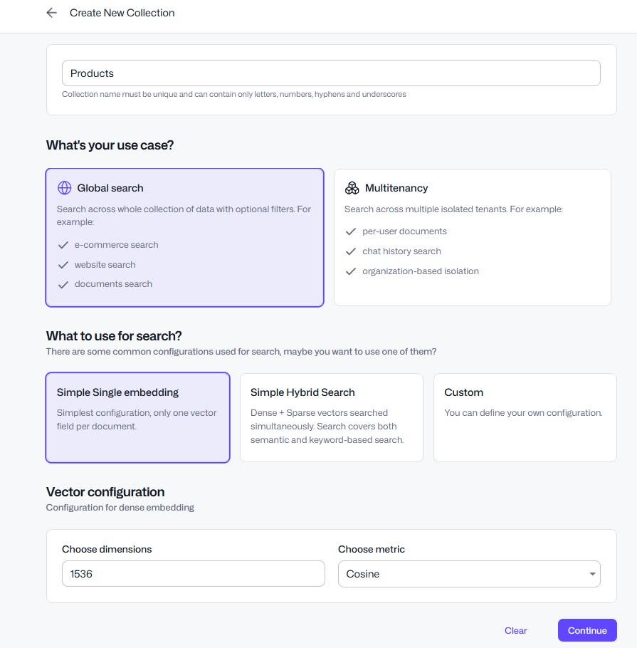
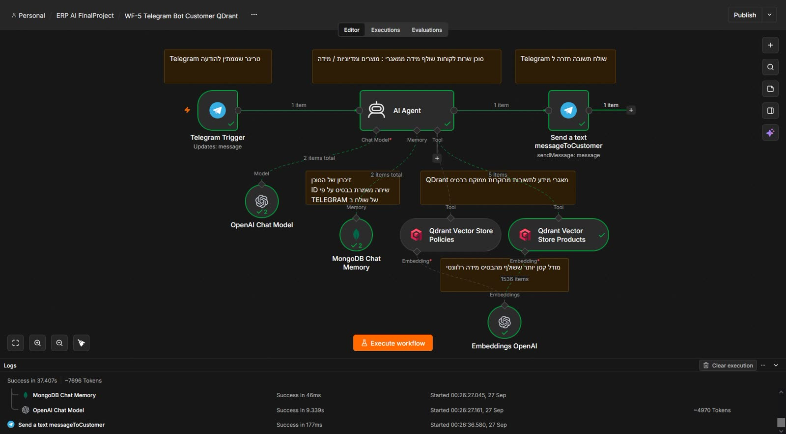
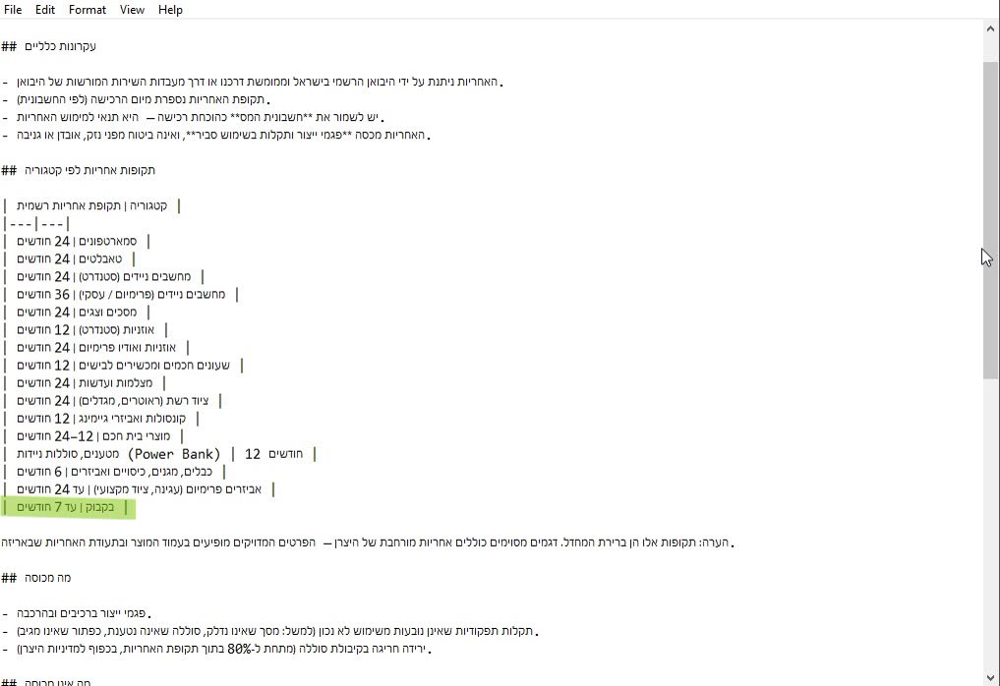
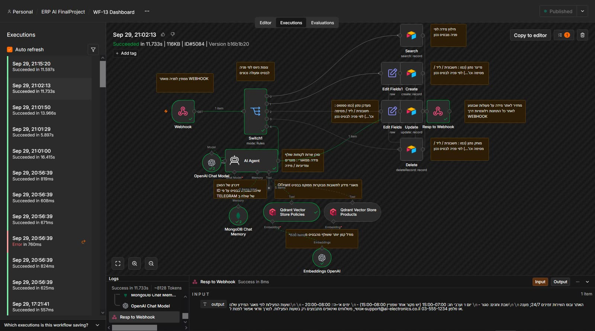
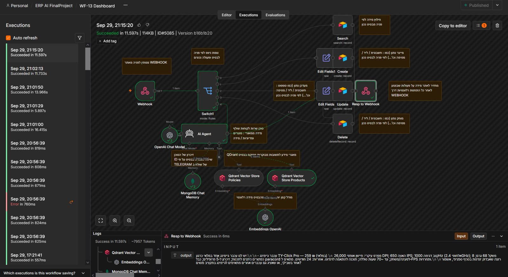

# 05 — The RAG pipeline

Two corpora, two collections, two ingestion workflows, one retrieval agent.

## The idea

The shop's knowledge is small and specific: warranty length, returns policy, shipping terms,
opening hours, and the product catalogue. A language model does not know any of that, and
inventing a 14-day return window when the shop offers 30 is a real failure with a real
customer.

So nothing is answered from the model's memory. Every factual answer is retrieved from a vector
store first, and the agent is told to refuse when the store does not cover the question.

## The two collections, and why they are not one

| | `policies` | `products` |
|---|---|---|
| Content | long-form policy text | short structured records |
| Ingestion | **WF-6**, chunked | **WF-7**, not chunked |
| One record is | ~a paragraph | one whole product |
| Typical query | "what is the warranty?" | "do you have blue headphones in stock?" |
| Metadata filter | source document name | category, SKU |

They are separate collections because the retrieval settings differ. Policy text needs a
meaningful chunk size and overlap, or a single answer gets split across two chunks and the
citation points at half the rule. A product record is one line — chunking it would produce
exactly one chunk and throw away the ability to filter by category.

This is the most transferable idea in the project: **the chunking decision is per-corpus, not
per-pipeline**, and the collection split is where that decision gets encoded.

## Ingestion

```
WF-6  policy document (uploaded via an n8n form)
        → Default Data Loader
        → Recursive Character Text Splitter   (chunked)
        → Embeddings                          (OpenAI-compatible)
        → Qdrant  → collection: policies

WF-7  product export (uploaded via an n8n form)
        → Airtable read
        → Embeddings
        → Qdrant  → collection: products      (no splitter node)
```

Both are **form triggers**, so re-ingestion is a deliberate human action. Correct for a policy
document that changes twice a year; wrong for a product feed, which would want a scheduled
Airtable trigger. The honest framing is that the product collection is only as fresh as the
last manual upload.




## Retrieval, as the agent uses it

WF-5's agent gets two tools rather than one:

- **`qdrant_policy_search`** — embeds the question, searches `policies` with a metadata filter
  on the source document, returns the top chunks.
- **`qdrant_product_search`** — embeds the question, searches `products`, returns matching
  catalogue entries with SKU and price.

One agent with two tools, because real questions cross the boundary. "Can I return the
headphones I bought last week, and do you have them in blue?" is a policy question *and* a
catalogue question, and splitting it into two agents would mean guessing which the customer
meant before they had finished typing.

The agent system prompt instructs it to:

1. search before answering anything factual;
2. state that the answer comes from the shop's published policy when it does;
3. decline, and offer to hand over to a human, when the collections do not cover the question.

Point 3 is the one that matters. An agent that always answers will always eventually be wrong
about a warranty, and it will be confidently wrong, in Hebrew, to a customer.

## Evidence that it is grounded

| Question | Behaviour |
|---|---|
| warranty length | answered from the policy document, with a source link |
| a specific product and its price | answered from the catalogue |
| opening hours | answered from the policy corpus |
| something not in either | declines |





The dashboard's `chat` action uses the same two collections, so the same grounding rules apply
in the admin panel.




## What is not done

- **No re-ranking.** Qdrant's similarity order is taken as-is. A cross-encoder or a
  `top_k` → re-rank step would improve precision for policy questions, where the right chunk is
  often not the most similar-looking one.
- **No hybrid search.** Pure vector search, so a query for an exact SKU or a product name can
  miss. A keyword/vector mix would fix it.
- **No evaluation set.** There is no set of questions with known-correct answers, so the claim
  "it is grounded" rests on the screenshots, not on a measurement. A small evaluation set is
  the first thing to add.
- **Embeddings are not re-generated on model change.** Switching embedding models without
  re-embedding the corpus produces silently bad retrieval, and nothing in the pipeline will
  warn you. The collection name should carry the model name.
