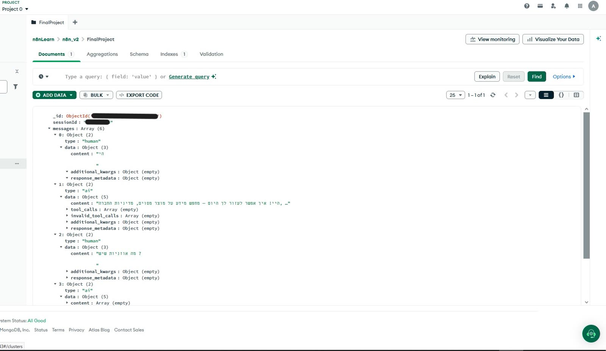
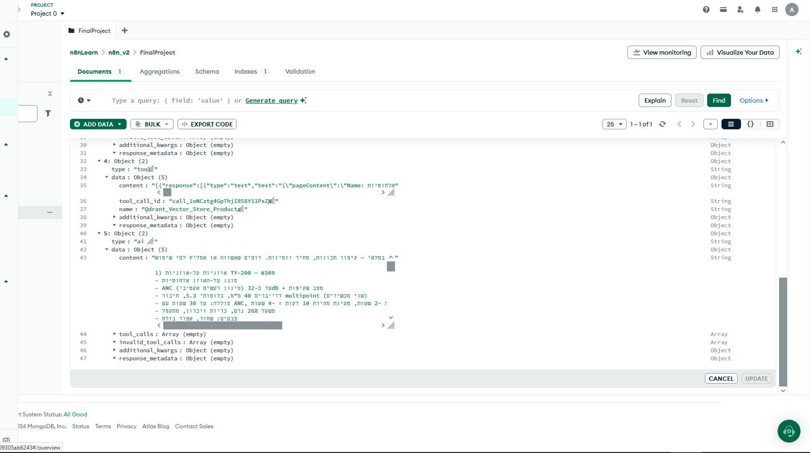
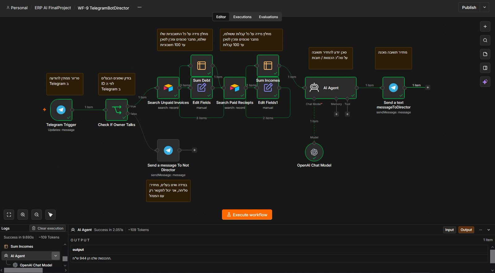

# 06 — The AI agents

Two agents. The interesting difference is not the prompts — it is that one of them is
restricted and one is not, and the restriction happens *before* the model is called.

## The comparison

| | **WF-5 — customer agent** | **WF-9 — director agent** |
|---|---|---|
| Surface | Telegram bot #2 | Telegram bot #1 |
| Access | anyone who messages it | one Telegram account only |
| Guard | none, by design | chat id compared to a stored owner id |
| Tools | two Qdrant retrieval tools | Airtable read + arithmetic |
| Memory | MongoDB Atlas chat memory | none |
| Answers from | policies + catalogue | rows in the `invoices` table |
| Refuses when | the collections do not cover it | the sender is not the owner |

## WF-5, the customer agent

Telegram → intent/chat node → agent loop with two tools → answer in Hebrew.

The system prompt carries the shop's identity, instructs Hebrew replies, and sets the
grounding rules described in [05-rag-pipeline.md](05-rag-pipeline.md). The most important
sentence is the refusal instruction, because an always-answering support agent eventually
invents a policy.

**Memory is MongoDB Atlas, not n8n's built-in window buffer.** The reason is restarts: an n8n
Cloud instance sleeps, and an in-memory buffer does not survive it. A customer asking "what
did you just tell me about the warranty?" after a redeploy would get a stranger's answer. The
conversation is persisted per chat id, and the same records are what the screenshot below
shows.




Memory has a failure mode worth naming: it persists indefinitely, so a customer who comes back
in a year is greeted as if the conversation never ended. A session id with a TTL, or a
date-based reset, would be the fix.

## WF-9, the director agent

This one starts with a check, not a prompt:

```
Telegram message
  → compare from.id against the stored owner chat id
      mismatch → reply "not authorised" → stop        ← the model is never called
      match   → continue
  → agent: sum income, sum outstanding debt
  → answer with figures
```

The refusal screenshot is the evidence that the branch works:





### Why this is not authentication

A Telegram `from.id` is a value the client supplies. Anyone who controls a Telegram account can
be any id they want, and any client can be built to claim one. So the check stops *casual*
misuse — the other bot, a family member, a customer who found the handle — and it stops nothing
else.

It is a **capability gate in front of a model, not a security boundary**, and the distinction is
worth being able to state out loud. A real fix would put a shared secret or an approval step
between Telegram and the financial data. See
[09-known-issues.md](09-known-issues.md#8-the-director-agent-authorisation-is-not-security).

## The honest comparison with a real assistant

Both agents are small. What is actually implemented:

- ✅ tool selection by the model across two collections
- ✅ refusal when retrieval is empty
- ✅ persistent conversation memory
- ✅ an access gate before the model runs

What is not:

- ❌ evaluation of answer quality (see [05-rag-pipeline.md](05-rag-pipeline.md))
- ❌ re-ranking or hybrid search
- ❌ handling of multi-step questions that need two retrievals in a particular order
- ❌ rate limiting, per-user quotas, or a cost ceiling on the agent loops
- ❌ any test that fails when a prompt is changed

The prompts are in the workflow JSON and are unremarkable: identity, language, grounding rules,
refusal instruction. The value in this project is in the wiring around them, not in the prose.

## Cost

Each agent turn is one chat completion plus one embedding, plus one vector search — cheap, but
WF-5 is reachable by anyone with the bot's handle, so an unbounded agent loop is a bill waiting
to happen. A per-chat turn counter in MongoDB, or a `max iterations` on the agent node, closes
it. Not currently done.
