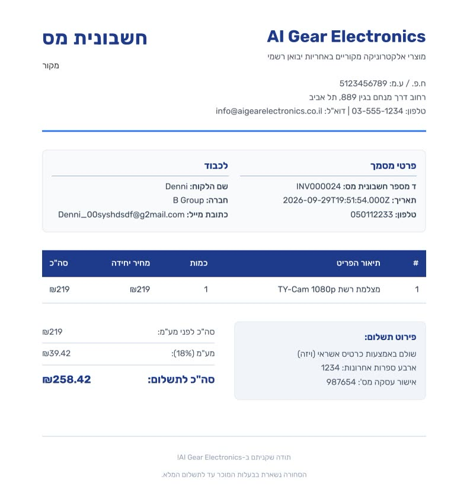
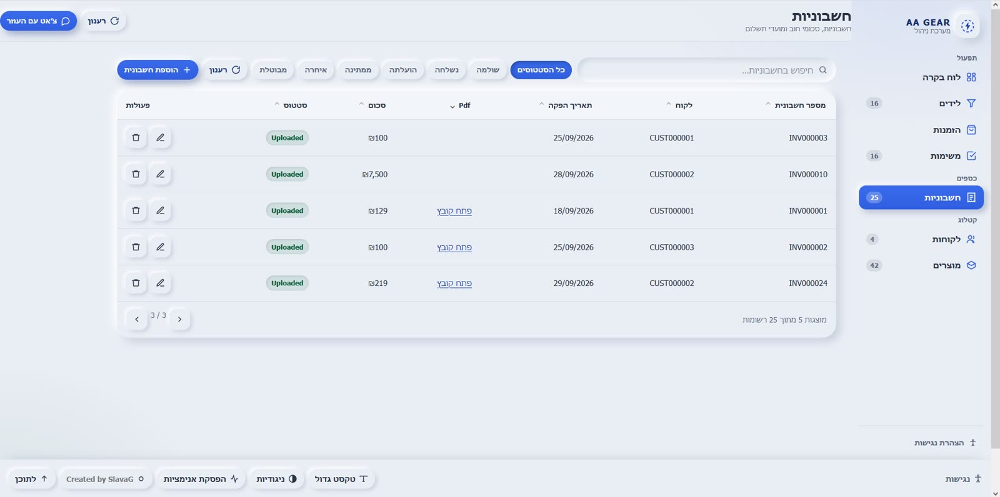

# 07 — Documents and PDF

WF-8 turns an Airtable row into a legal-looking Israeli document in Google Drive, and writes
the link back onto the row.

## Why three document types

Israeli retail accounting distinguishes three things, and they are not interchangeable:

| Type | Hebrew | What it is |
|---|---|---|
| Tax invoice | `חשבונית מס` | For a VAT-registered business buyer. Requires the buyer's business details, and carries a line for "document issued electronically and not signed". |
| Invoice | `חשבונית` | B2C receipt-style invoice for a private customer. No buyer business details required. |
| Receipt | `קבלה` | Immediate payment, goods handed over. No credit terms, no payment terms. |

Issuing a `חשבונית מס` where a `קבלה` was owed, or missing a required field, is a genuine
compliance problem. So the three templates in WF-8 differ in **required fields**, not just
wording, and the type is chosen by the `InvoiceType` field rather than inferred.

## The pipeline

```
WF-1   new invoice row → validate → Status = Pending
WF-8   every 59s
         → Airtable: read rows where Status = Pending
         → switch on InvoiceType
             חשבונית      → invoice template
             חשבונית מס   → tax invoice template  (+ the "issued electronically" line)
             קבלה         → receipt template
         → community PDF node  →  PDF
         → Google Drive upload
         → write the share link back to the invoice row
```

The dashboard then shows that link on the invoice.

| Receipt | Tax invoice | Back in the dashboard |
|---|---|---|
|  |  |  |

## VAT

18% Israeli VAT. Prices in Airtable are stored **gross**; the net figure is derived in the
template where the document has to print it. Storing net and deriving gross would arguably be
cleaner — the gross number is what the customer pays, so it is the one that should be
authoritative — but that is a base migration, not a template change, so it is noted rather than
attempted here.

## The hard dependency

WF-8 needs `@custom-js/n8n-nodes-pdf-toolkit-v2`. This is the project's most fragile point:

- it is a **community** node, not a core n8n node, so it is not available on every plan;
- specifically, it **cannot be installed on n8n Cloud's free plan**;
- if it is missing, the workflow will not import cleanly and WF-8 will not run at all.

The fallbacks, in order of preference:

1. n8n Cloud **Pro or above**, where community nodes can be installed;
2. self-hosted n8n, free, and the node works;
3. replace the node with a plain `Convert to File` → PDF service call (an HTML-to-PDF API, or
   headless Chrome) inside a Function node.

Option 3 costs the least and removes the dependency permanently, which is the right answer for
anything that is not a course submission.

## The 59-second poll, honestly

Polling every 59 seconds instead of every 60 looks like superstition. It is a crude attempt to
keep WF-8's read of the `invoices` table from landing in the same second WF-1 wrote a
`Pending` status into it, which would let a brand-new invoice be rendered before validation
finished. It reduces the collision; it does not eliminate it.

The two real fixes are an Airtable **view** — `view=Pending` with a formula that also excludes
recently-updated rows — or a proper trigger. The view is a five-minute change and would also
make the query cheaper.

## The numbering race

Invoice numbers are allocated as `count + 1`. With a 59-second poll, two invoices created in
the same window can be read at the same moment, both compute the same next number, and one
overwrites the other.

The fix is a single record acting as a counter, incremented inside n8n — which is not
transactional either, so the real fix is a deterministic number derived from something unique
(the record id, or a timestamp plus a random suffix), and accepting that the number is not
strictly sequential. That is the right call for a tax document: uniqueness matters, and
consecutive numbering is a preference. Not yet done.

## The Drive link

WF-8 uploads to Drive and stores a share link on the invoice row. Two notes:

- the link's **sharing scope** is whatever the connected Drive account defaults to. For a course
  project that default is usually "anyone with the link", which is how a demo works and exactly
  how a real invoice must not be shared.
- storing a Drive link means Drive's permissions are now part of the ERP's security model, which
  is not documented anywhere except here.
